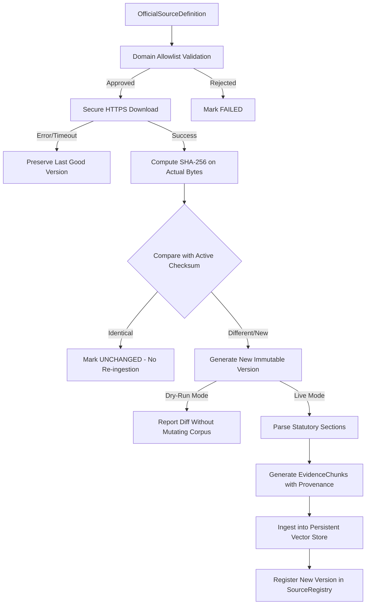

# IP-SAKTI Automated Corpus Update & Versioning Status

## 1. Overview
The IP-SAKTI Sahayak knowledge base utilizes a controlled, version-aware, and cryptographically verified update pipeline for statutory and regulatory legal sources. It ensures that legal changes are automatically discovered and ingested into the persistent vector store while strictly maintaining provenance and preventing corpus corruption.

---

## 2. Authoritative Source Registry
Official sources are defined via `OfficialSourceDefinition` within [backend/app/rag/source_registry.py](file:///c:/Users/ADITHYA/Desktop/Projects/IP-SAKTI/backend/app/rag/source_registry.py):

| Field | Description | Example |
|---|---|---|
| `source_id` | Unique statutory identifier | `SRC_IN_PATENTS_ACT_1970` |
| `title` | Full official publication title | The Patents Act, 1970 (India) |
| `authority` | Governing body | Parliament of India / CGPDTM |
| `canonical_url` | Approved official HTTPS endpoint | `https://ipindia.gov.in/patents-act-1970.htm` |
| `jurisdiction` | Broad jurisdiction | `India` or `International` |
| `country` / `region` | Granular jurisdiction filters | `India`, `Germany`, `EU`, `USA` |
| `applicable_countries` | Target country eligibility list | `["Germany", "EU"]` |
| `source_type` | Statutory classification | `statute`, `treaty`, `regulation`, `pharmacopoeia` |
| `update_strategy` | Ingestion mode | `checksum_diff` |

### Approved Official Domains
Only domains in `ALLOWED_AUTHORITY_DOMAINS` are permitted:
- **India**: `ipindia.gov.in`, `indiacode.nic.in`, `nbaindia.org`, `cdsco.gov.in`, `fssai.gov.in`, `tkdl.res.in`, `ayush.gov.in`, `main.sci.gov.in`, `delhihighcourt.nic.in`
- **International**: `wipo.int`, `cbd.int`, `epo.org`, `uspto.gov`, `dpma.de`, `gesetze-im-internet.de`, `eur-lex.europa.eu`, `wto.org`, `who.int`

---

## 3. Update Flow & Cryptographic Checksumming
The update lifecycle follows strict security and integrity steps:



---

## 4. Immutable Versioning Model
- **Historical Preservation**: Previous versions are never overwritten or deleted. Historical metadata is preserved in `source_registry.source_versions[source_id]`.
- **Deterministic Version Tags**: Formatted using monotonic sequence numbers and timestamps: `v{num}.0_{YYYYMMDD}`.
- **Deduplication**: Vector store indexing uses compound deduplication keys `(chunk_id:checksum)` to prevent redundant chunk duplication under the same version.

---

## 5. Dry-Run Mode
The update pipeline supports non-destructive auditing:
- **Execution**: `corpus_updater.run_update_cycle(dry_run=True)`
- **Behavior**: Downloads and validates canonical sources and calculates checksums, reporting `NEW`, `UPDATED`, `UNCHANGED`, or `FAILED` without mutating active source registry entries or vector store indices.

---

## 6. Failure Handling & Isolation
- **Temporary Failure Resilience**: If an official portal experiences a 500 error or network timeout, that individual source is marked `FAILED`. The existing active version and vector store chunks remain active and unaffected.
- **No Empty Overwrites**: Failed or empty downloads are never treated as empty documents and cannot overwrite valid legal text.
- **Batch Continuation**: A failure in one source does not halt the update cycle for other sources.

---

## 7. Politeness & Rate Limiting
- **Concurrency Bounding**: Configurable semaphore limit (`concurrency=3` by default) prevents overwhelming government servers.
- **Request Delays**: Introduces politeness pacing between downloads (`request_delay_seconds=0.2`).
- **Strict Size/Time Ceilings**: Enforces 25 MB max document size and 15s request timeouts.

---

## 8. Manual & External Scheduling Invocation

### Python / Script Invocation
```python
import asyncio
from app.rag.updater import corpus_updater

async def main():
    # Dry run audit
    report = await corpus_updater.run_update_cycle(dry_run=True)
    print(f"Checked: {report.total_sources_checked}, Changed: {report.updated_sources}")

    # Live update
    # report = await corpus_updater.run_update_cycle(dry_run=False)

if __name__ == "__main__":
    asyncio.run(main())
```

### Future External Triggers
- **Render / Cloud Cron**: Trigger a lightweight periodic CLI script or authenticated management endpoint.
- **GitHub Actions Scheduled Workflow**: Run periodic scheduled dry-run or update checks in CI.
